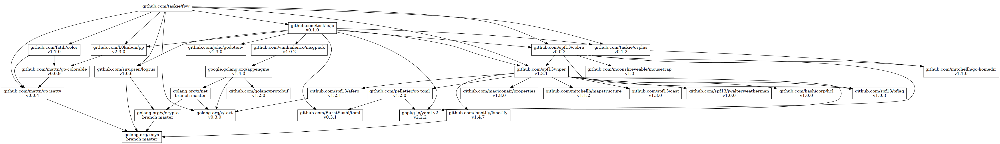

# fwv

manipulate “Fixed Width Values”


## Install

```sh
go get -u github.com/taskie/fwv/cmd/fwv
```

## Usage

### Convert CSV to Fixed Width Values

```sh
fwv foo.csv foo.txt
```

or

```sh
fwv -f csv <foo.csv >foo.txt
```

#### foo.csv (input)

```csv
a,bb,あいう,ccc
漢字,d,eee,f
```

#### foo.txt (output)

```txt
a    bb あいう ccc
漢字 d  eee    f
```

### Convert Fixed Width Values to CSV

```sh
fwv foo.txt foo.csv
```

or

```sh
fwv -t csv <foo.txt >foo.csv
```

### Treat "Eastern Asian Ambiguous Width" as halfwidth

```sh
fwv -E
```

or

```sh
env FWV_EAA_HALF_WIDTH=1 fwv
```

### Ignore character width

Only the number of characters (runes) are considered.

```sh
fwv -W
```

### Specify a delimiter

```sh
fwv -d '│'
```

#### foo.txt (output)

```txt
a   │bb│あいう│ccc
漢字│d │eee   │f
```

## Dependencies



## License

Apache License 2.0
